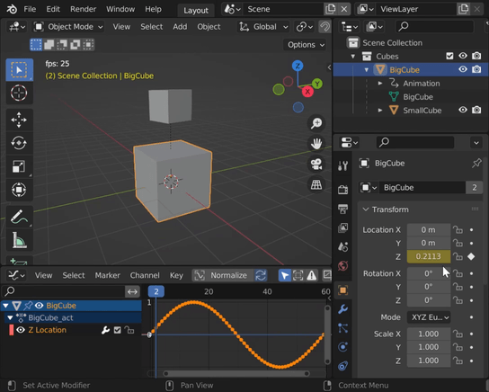
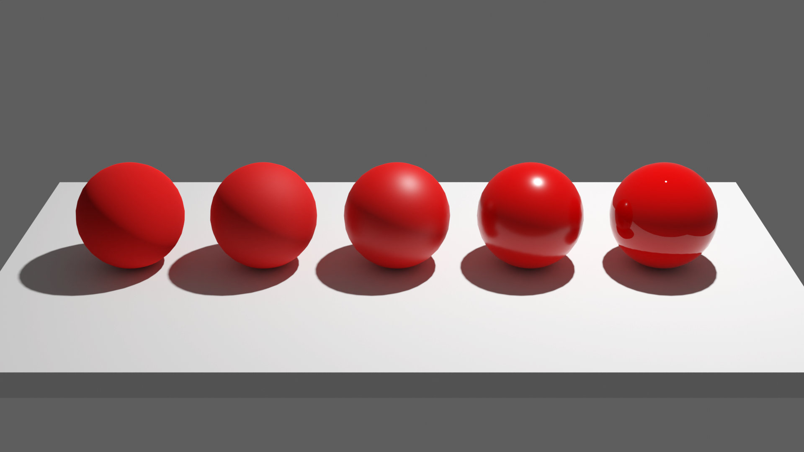
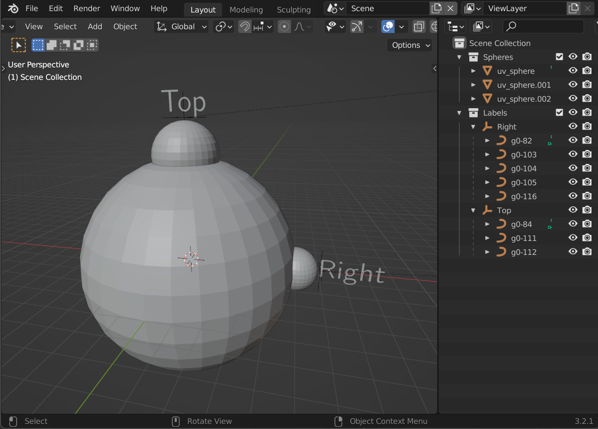
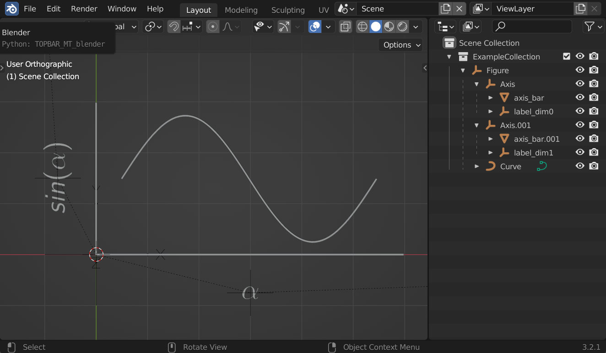
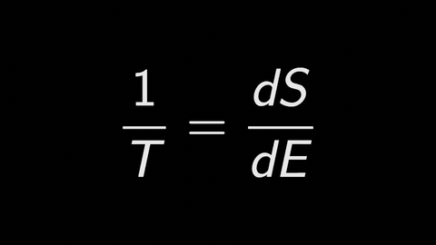

# hlbpy

hlbpy (high level blender python) is a library intended to make it more convenient to set up scenes in Blender with python. 

If you have ever used the blender python api, you have probably noticed that it is not really designed to quickly build scenes with it. Even doing simple stuff (e.g. adding a cube to the scene) can easily require several lines of code. hlbpy essentially adds a high level layer above the blender python api to make typical scene building tasks easier. 

I mainly write this library for my myself, to make it easier to create videos for my YouTube channel: [youtube.com/c/marblescience](https://www.youtube.com/c/marblescience)
Anyway, you are welcome to use the code! Just be aware that it is far from complete, far from well tested, and far from well documented.

## Usage

Here is some code examples to give you an idea how you can use hlbpy.

### Basic Scene

```python
import hlbpy
from math import pi
import numpy as np

hlbpy.run_in_blender()

scene = hlbpy.Scene.from_context()

cubes = scene.link(hlbpy.Collection("Cubes"))

big_cube = cubes.link(hlbpy.mesh.Cube(edge_length=2, name="BigCube"))
small_cube = cubes.link(hlbpy.mesh.Cube(edge_length=1, name="SmallCube"))

small_cube.location = (0, 0, 2.5)

small_cube.parent = big_cube

big_cube.set_keyframes("location", np.sin(np.linspace(0, 2*pi, 60)), index=2)
small_cube.set_keyframes("rotation_euler", [[0, 0, 0], [0, 0, 2*pi]], frame_numbers=[0, 60])

scene.frame_end = 60
```
In this example, we create a new collection "Cubes".  
We link two cubes to this collection.  
We change the location of one cube.  
We parent one cube to the other.  
Finally, we add keyframes to animate the cubes.  

Once executed, this code opens blender, and this is what you would see:



### Assign Materials
```python
import hlbpy

hlbpy.run_in_blender()

scene = hlbpy.Scene.from_context()
environment = scene.link(hlbpy.Collection("Environment"))
marbles = scene.link(hlbpy.Collection("Marbles"))

ground = environment.link(hlbpy.mesh.Cuboid((6, 3, 0.2)))
ground.location = (2, 0, -0.1)

for i in range(5):
    marble = marbles.link(hlbpy.mesh.UVSphere(radius=0.4))
    marble.shade_smooth()
    marble.location = (i, 0, 0.4)

    red_material = hlbpy.material.PrincipledBSDF(name="Red", srgb=(200, 0, 0))
    red_material.roughness = 1 - i / 4
    marble.material = red_material
```


### Relative Placement
```python
import hlbpy
from hlbpy.directions import *
from math import pi

hlbpy.run_in_blender()

scene = hlbpy.Scene.from_context()

spheres = scene.link(hlbpy.Collection("Spheres"))
labels = scene.link(hlbpy.Collection("Labels"))

main_sphere = spheres.link(hlbpy.mesh.UVSphere(radius=5))

sphere_right = spheres.link(hlbpy.mesh.UVSphere(radius=1))
sphere_right.location = main_sphere.right

label_right = labels.link(hlbpy.special.Tex("Right"))
label_right.align_children(LEFT)
label_right.rotation_euler = (pi/2, 0, 0)
label_right.location = sphere_right.right + 0.1 * RIGHT

sphere_top = spheres.link(hlbpy.mesh.UVSphere(radius=1.5))
sphere_top.location = main_sphere.top

label_top = labels.link(hlbpy.special.Tex("Top"))
label_top.align_children(OUT)
label_top.rotation_euler = (pi/2, 0, 0)

label_top.location = sphere_top.top + 0.1 * UP
```



### Basic Plotting
```python
import hlbpy
import numpy as np

hlbpy.run_in_blender()

scene = hlbpy.Scene.from_context()
collection = scene.link(hlbpy.Collection("ExampleCollection"))

x_values = np.linspace(0, np.pi * 2, 100)
y_values = np.sin(x_values)

data = np.stack((x_values, y_values), axis=1)

fig = hlbpy.plotting.Figure(shape=(6, 3))
fig.line_plot(data)
fig.axes[0].set_latex_label(r"$\alpha$")
fig.axes[1].set_latex_label(r"$sin(\alpha)$")

collection.link(fig)

hlbpy.view.set_view([0, 0, 0], orthographic=True)
```


### Latex Formulas and Morphing
```python
import hlbpy

hlbpy.run_in_blender()

scene = hlbpy.Scene("TestScene")
collection = scene.link(hlbpy.Collection("ExampleCollection"))

tex1 = collection.link(hlbpy.special.MathTex(r"\frac{1}{T} = ", "{dS", r" \over", " dE}"))
tex2 = collection.link(hlbpy.special.MathTex(r"\frac{1}{T} = ", "{\Delta S", r" \over", " \Delta E}"))

tex1.transform(tex2, start=0, n_frames=30)

tex3 = collection.link(
        hlbpy.special.MathTex(r"\frac{1}{T} = ", r"{S_{E+\Delta E} - S_E", r" \over", " \Delta E}"))
tex2.transform(tex3, start=50, n_frames=30)

hlbpy.view.set_view([0, 0, 0], orthographic=True)
```


## Installation
(to be added)

## License
This code is under the [GPL3 License](LICENSE). 
An exception is the code in the "external" and the "io_curve_svg" directories. I have not written this code myself. 
You can find information about the authors and the License for those files at the top of each file. 
Some of it is from Grant Sanderson's great [Manim library](https://github.com/3b1b/manim) which in general has been an inspiration for a lot of the stuff in this library.
